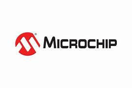

<div align="center">

  <h1>🧰 Buildroot OS – Microchip PolarFire® SoC (Icicle Kit)</h1>
  
  <p>
    This repository provides a complete guide and configuration to build a bootable Linux image for the  
    <b>Microchip PolarFire® SoC Icicle Kit</b> using the <b>Microchip Buildroot External</b> extension.
  </p>

  <a href="https://www.microchip.com/" target="_blank">
    
  </a>

  <br><br>
  
  
  
</div>

---

## 📘 Table of Contents

| 🔢 | 📂 Topic | 🔗 Link |
|----|----------|--------|
|  1 | **About this Repository** | [Jump to Section](#about-this-repository) |
|  2 | **System Dependencies (Host)**        | [Jump to Section](#system-dependencies-host) |
|  3 | **Repository Layout & Supported Versions** | [Jump to Section](#repository-layout-supported-versions) |
|  4 | **Clone, Configure & Build**           | [Jump to Section](#clone-configure-build) |
|  5 | **Flashing the Image (SD/eMMC/QSPI)**  | [Jump to Section](#flashing-the-image) |
|  6 | **Optional Package/Kernel Configuration** | [Jump to Section](#optional-packagekernel-configuration) |
|  7 | **Supported Board Families / Defconfigs** | [Jump to Section](#supported-board-families--defconfigs) |
|  8 | **Troubleshooting & Tips**             | [Jump to Section](#troubleshooting--tips) |
|  9 | **License & Credits**                  | [Jump to Section](#license--credits) |

---

## 🧩 <a name="about-this-repository"></a>1. About this Repository

This repository contains build instructions, configs, and a streamlined workflow to generate a bootable Linux image using  
the :contentReference[oaicite:0]{index=0} system along with the :contentReference[oaicite:1]{index=1} for the  
:contentReference[oaicite:2]{index=2} SoC Icicle Kit from :contentReference[oaicite:3]{index=3}.

The end result is a root filesystem, U-Boot, kernel/FIT-image, and device tree blob tailored for the board.

---

## ⚙️ <a name="system-dependencies-host"></a>2. System Dependencies (Host)

Tested on **Ubuntu 22.04 LTS**. Install the required host build tools:

```bash
sudo apt update
sudo apt install -y subversion build-essential bison flex gettext \
  libncurses5-dev texinfo autoconf automake libtool mercurial git \
  gperf gawk expat curl cvs libexpat-dev bzr unzip bc python3-dev \
  wget cpio rsync xxd bmap-tools
```
## 📁 Repository Layout & Supported Versions

This setup uses two major components:

- `buildroot-external-microchip`: Microchip’s extension containing board-specific packages, patches, and configs.  
- **Buildroot tree:** Use the version matching your board family as mentioned in the external repository.

### Example Versions

- For **PolarFire SoC / Icicle Kit** → Buildroot version **2025.02** (tested).  
- For **other Microchip SoC families** (AT91, PIC64GX) → check the external’s README for matching Buildroot versions.

---

## 🧪 Clone, Configure & Build

### 4.1 Clone the repositories

```bash
git clone https://github.com/linux4microchip/buildroot-external-microchip.git
git clone https://git.busybox.net/buildroot -b 2025.02 buildroot
```

### 4.2 Configure Buildroot for Icicle Kit
```bash
cd buildroot
export BR2_EXTERNAL=../buildroot-external-microchip/
BR2_EXTERNAL=$BR2_EXTERNAL make icicle_defconfig
```
### 4.3 Build the image
```bash
make -j$(nproc)
```
Upon successful completion you will find images in output/images, including sdcard.img (for SD/eMMC) and other binaries (U-Boot, FIT, dtb).

## 💾 <a name="flashing-the-image"></a>5. Flashing the Image (SD / eMMC / QSPI)

**CAUTION**: Verify device path via **lsblk** to avoid erasing the wrong device.

### 5.1 SD/eMMC (typical)
```bash
cd output/images
sudo dd if=sdcard.img of=/dev/sdX bs=1M status=progress conv=fsync
# recommended — faster:
sudo bmaptool copy sdcard.img /dev/sdX
```

You may also use cross-platform tools such as Etcher or USBImager.

### 5.2 QSPI NOR / NAND (if built)

If using QSPI flash or NAND, images like nor.img or nand.img will be generated. Refer to the PolarFire SoC user guide for programming steps.
