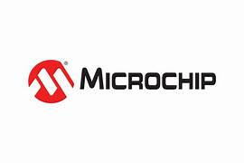
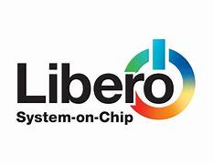
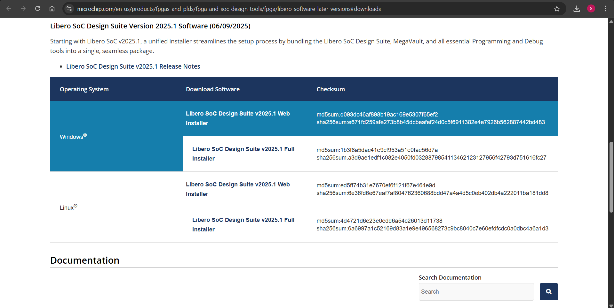
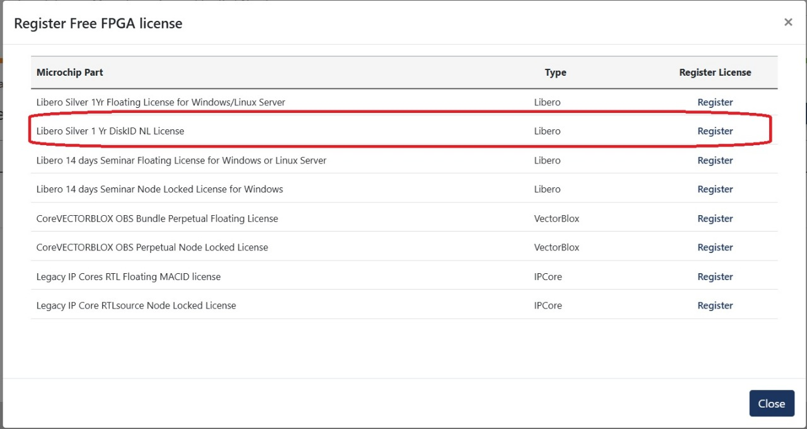
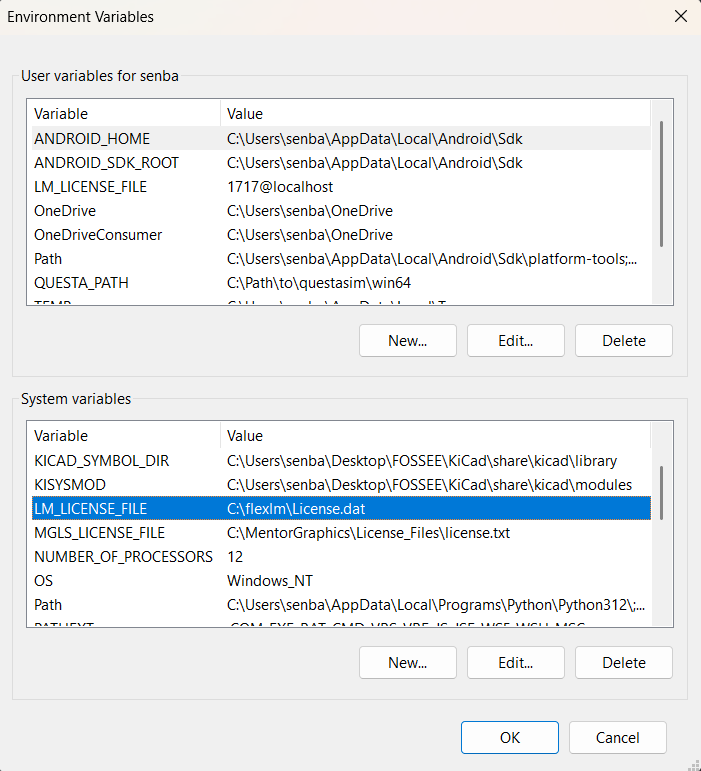
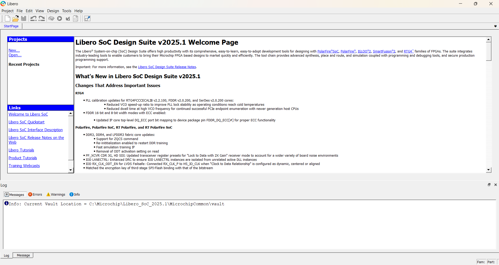
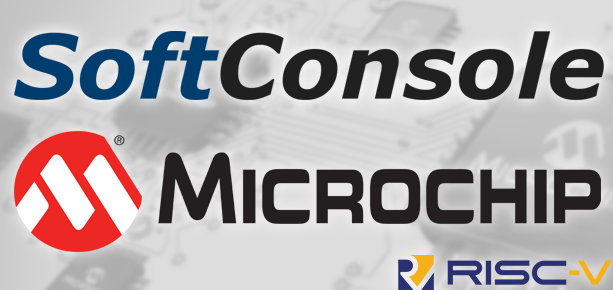
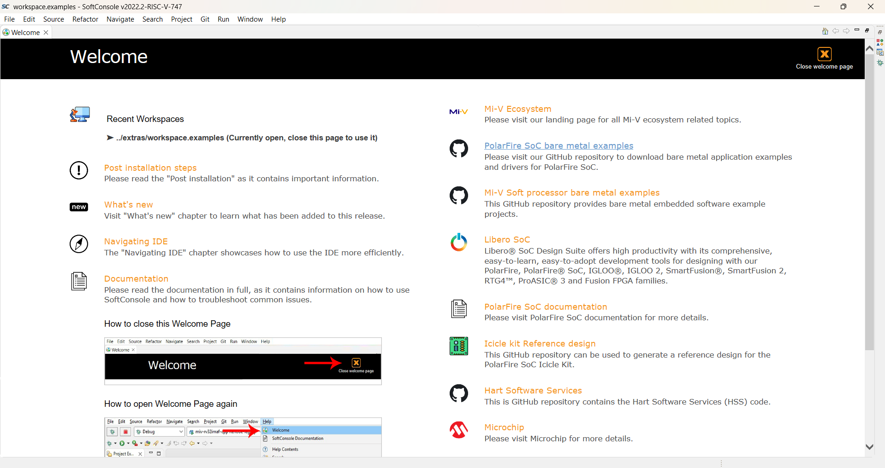

<div align="center">

  <h1>🧰 Tool Installation & Setup Guide</h1>
  
  <p>
    This section provides a complete guide for installing and configuring  
    the development tools required to work with the  
    <b>Microchip PolarFire® SoC Icicle Kit</b> used in the  
    <b>EdgeSight – AI-Powered Assistive Vision System</b> project.
  </p>

  <a href="https://www.microchip.com/" target="_blank">
  
</a>

  <br><br>
  
  
  
  
</div>

---

# 📘 Table of Contents

| 🔢 # | 📂 Topic | 🔗 Link |
|------|----------|---------|
| 1 | **About Libero® SoC Design Suite** | [Jump to Section](#-1-about-libero-soc-design-suite) |
| 2 | **Libero® SoC Installation & License Setup** | [Jump to Section](#-2-libero-soc-installation--license-setup) |
| 3 | **About SoftConsole IDE** | [Jump to Section](#-3-about-softconsole-ide) |
| 4 | **SoftConsole Installation & Setup** | [Jump to Section](#-4-softconsole-installation--setup) |
| 5 | **Summary** | [Jump to Section](#-summary) |
| 6 | **Acknowledgment** | [Jump to Section](#-acknowledgment) |
| 7 | **Contributors** | [Jump to Section](#-contributors) |


---

## 🧩 1. About Libero® SoC Design Suite

**Libero® SoC Design Suite** is Microchip’s complete FPGA design environment that enables the design, synthesis, simulation, and programming of FPGAs such as the **PolarFire® SoC Icicle Kit**.  
It is the core tool used for developing the **FPGA hardware logic**, including custom accelerators, peripheral interfaces, and RTL design.
<p align="center">
  
</p>


### 🔹 Key Features
- SmartDesign graphical system integration environment  
- Supports **VHDL**, **Verilog**, and **mixed-language** designs  
- Built-in **simulation**, **timing analysis**, and **device programming** tools  
- Seamless integration with **SoftConsole IDE** for co-design  
- Generates bitstream files for **PolarFire® SoC FPGA**  
- Ideal for **AI/ML acceleration**, **vision**, and **motor control** applications  

### 🔹 Official Resources
- 🔗 [Libero SoC Download Page](https://www.microchip.com/en-us/products/fpgas-and-plds/fpga-and-soc-design-tools/fpga/libero-software-later-versions#downloads)  
- 🔗 [Microchip License Portal](https://www.microchipdirect.com/fpga-software-products)

---

## ⚙️ 2. Libero® SoC Installation & License Setup

### 🪜 Step 1: Download the Tool
1. Go to the official download page:  
   👉 [Libero SoC Design Suite 2025.01](https://www.microchip.com/en-us/products/fpgas-and-plds/fpga-and-soc-design-tools/fpga/libero-software-later-versions#downloads)
2. Download the correct version for your OS (Windows/Linux).  
3. Extract the downloaded archive and begin installation.  



---

### 🪜 Step 2: Obtain the License
1. Navigate to:  
   👉 [Microchip License Portal](https://www.microchipdirect.com/fpga-software-products)
2. Select **Libero Silver 1-Year DiskID NL License**.  
3. When prompted, enter your **Disk ID** (unique to your system).

<p align="center">
  
</p>

#### 🧾 To Find Disk ID (Windows)
Open **Command Prompt** and run:
```bash
vol C:
```

You’ll get an output like:

```bash 
Volume in drive C is OS
Volume Serial Number is XXXX-XXXX
```

The **Volume Serial Number** is your Disk ID.

4. After submission, **Microchip** will send you a License.dat file.

### 🪜 Step 3: Save the License File

1. Create a new folder in your C drive:
   ```bash
   C:\flexlm
    ```
2. Copy the provided **License.dat** file into this folder.

### 🪜 Step 4: Set Environment Variable

1. Open **System Properties → Advanced System Settings → Environment Variables**.  
   _(Shortcut: press `Windows + W` → search “Environment Variables”)_

2. Under **System Variables**:

   - If `LM_LICENSE_FILE` exists → **Edit** → add  
     ```bash
     C:\flexlm\License.dat
     ```
   - If not → **Create New Variable**  
     ```bash
     Name:  LM_LICENSE_FILE
     Value: C:\flexlm\License.dat
     ```

> ⚠️ Ensure path and folder names match exactly (case-sensitive).

3. Click **OK** to apply and close all dialogs.

---

<p align="center">
  
</p>


### 🪜 Step 5: Verify Installation

- Launch **Libero SoC Design Suite**.  
- Navigate to **Help → Manage License**.  
- Verify that **Libero Silver License** is detected.

✅ **Libero SoC 2025.01** is now fully installed and ready for FPGA design.

<p align="center">
  
</p>


---

## 💻 3. About SoftConsole IDE

**SoftConsole** is Microchip’s **Eclipse-based Integrated Development Environment (IDE)** for software development on **RISC-V** and **ARM-based SoCs**.  
For the **PolarFire® SoC Icicle Kit**, SoftConsole is used to develop and debug C/C++ firmware that runs on the RISC-V cores, coordinating with FPGA logic designed in Libero.



### 🔹 Key Features

- Supports **bare-metal** and **Linux-based** RISC-V applications  
- Integrated **GCC toolchain** and **debugger**  
- Prebuilt **Board Support Packages (BSPs)** for PolarFire SoC  
- Seamless **hardware-software co-design** with Libero  
- Ideal for real-time control, data acquisition, and sensor processing tasks  

### 🔹 Official Resource

🔗 [SoftConsole IDE Download Page]([https://www.microchip.com/en-us/tools-resources/develop/microchip-softconsole](https://ww1.microchip.com/downloads/secure/aemDocuments/documents/FPGA/media-content/FPGA/SoftConsole/v2022-2/Microchip-SoftConsole-v2022.2-RISC-V-747-windows-x64-installer.exe))

---

## ⚙️ 4. SoftConsole Installation & Setup

### 🪜 Step 1: Installation

1. Download **SoftConsole v2024.2 or newer** from the official Microchip page.  
2. Install or extract the package based on your OS.  
3. Launch the IDE and configure your workspace folder.

---

### 🪜 Step 2: Board Setup

1. Install the **PolarFire® SoC BSP (Board Support Package)** when prompted.  
2. Connect your **Icicle Kit** to the PC using USB.  
3. Open the terminal in **SoftConsole** to check UART communication.

---

### 🪜 Step 3: Verification

- Create a sample RISC-V “Hello World” project.  
- Build and program it using the **Debug** option.  
- Verify output on the serial console.

✅ **SoftConsole** is now ready for firmware development and debugging.



---
---

## 🧾 Summary

In this setup phase, we successfully installed and configured the essential software tools required for FPGA and SoC development using the **PolarFire® SoC Icicle Kit**.  

The following tools were set up and verified:
- **Libero® SoC Design Suite 2025.01** — for FPGA design, synthesis, and bitstream generation.  
- **SoftConsole IDE** — for RISC-V software development, debugging, and hardware-software co-integration.  

These installations mark the foundation of our **EdgeSight – AI-Powered Assistive Vision Device** project, enabling efficient design and development on the **Microchip PolarFire® SoC platform**.  

With the toolchain now fully operational, our next phase involves creating the FPGA hardware architecture and RISC-V firmware integration to bring the EdgeSight system to life.

---

## 🙏 Acknowledgment

We would like to express our sincere gratitude to **Microchip Technology Inc.** for providing access to the **PolarFire® SoC Icicle Kit** and supporting tools such as **Libero® SoC** and **SoftConsole IDE**.  
Their platform and resources have been instrumental in enabling innovation for this **VLSI Design Contest**.

Thank you, **Microchip**, for empowering students and developers worldwide to explore next-generation SoC and FPGA technologies.

---

## 👩‍💻 Contributors

| Name | GitHub Profile |
|------|----------------|
| **Senbagaseelan V** | [@Senbagaseelan18](https://github.com/Senbagaseelan18) |
| **Praveen R** | [@PRAVEENRAMU14](https://github.com/PRAVEENRAMU14) |
| **Ragul T** | [@Ragul-2005](https://github.com/Ragul-2005) |
| **Tharun Babu V** | [@TharunBabu-05](https://github.com/TharunBabu-05) |

---

<div align="center">


**© 2025 VLSI Design Contest – EdgeSight Project Team**  
**Powered by Microchip PolarFire® SoC Technology**

</div>


<div align="center">


</div>

